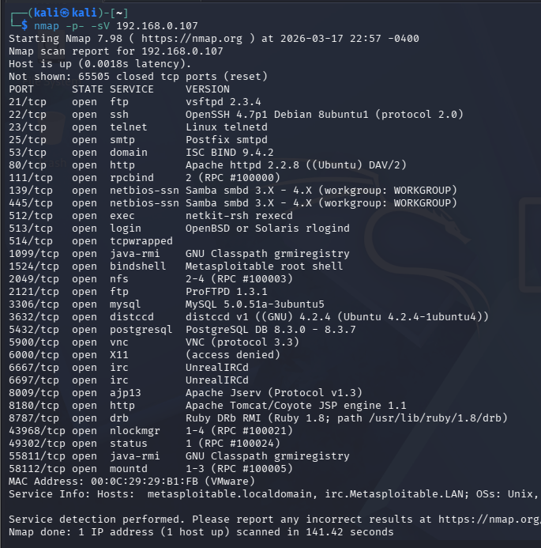
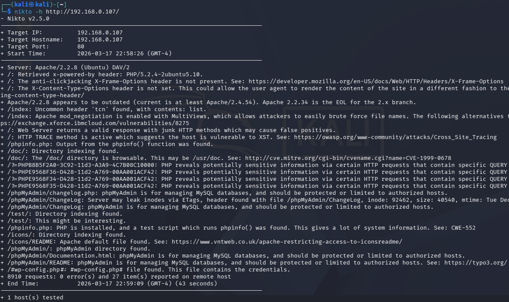
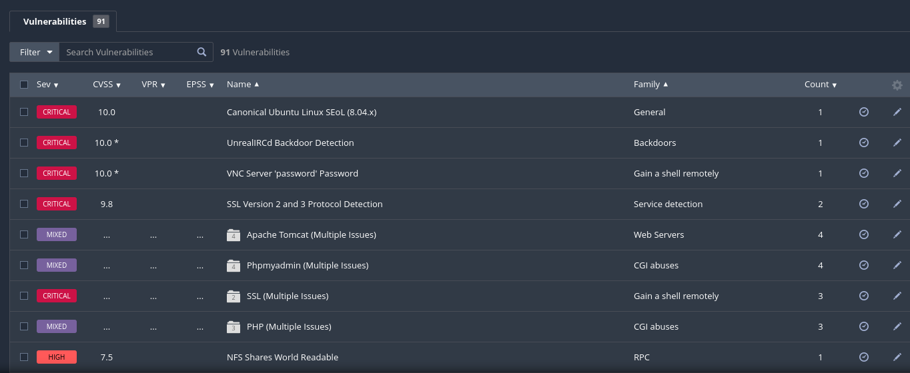
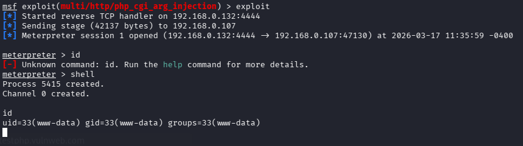
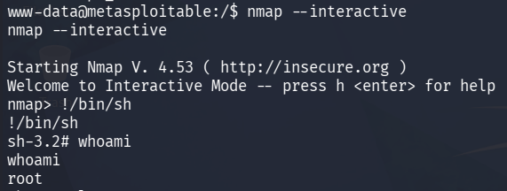
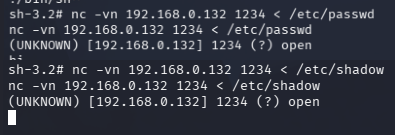
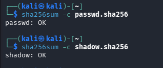
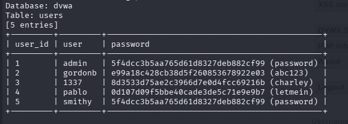

# VAPT Lab – Week 2

## Overview
This project demonstrates a complete Vulnerability Assessment and Penetration Testing (VAPT) cycle performed in a controlled lab environment using Kali Linux and Metasploitable 2.

---

## Target Details
- **Attacker Machine:** Kali Linux (192.168.0.132)
- **Target Machine:** Metasploitable 2 (192.168.0.107)

---

## Tools Used
- Nmap
- Nikto
- Nessus
- Metasploit
- GTFOBins
- sqlmap
- sha256sum

---

## Methodology

### 1. Reconnaissance
- WHOIS information gathered using Maltego
- Subdomain enumeration using Subfinder
- Technology stack identified using Wappalyzer

---

### 2. Vulnerability Scanning
- Nmap used for port and service enumeration
- Nikto used for web vulnerability scanning
- Nessus used for automated vulnerability assessment

---

### 3. Exploitation
- Identified PHP-CGI vulnerability (CVE-2012-1823)
- Exploited using Metasploit module
- Successfully gained Meterpreter session

---

### 4. Post-Exploitation
- Upgraded shell using Python PTY
- Identified SUID binaries
- Privilege escalation achieved using SUID Nmap binary
- Collected sensitive files (/etc/passwd, /etc/shadow)
- Verified integrity using SHA256 hashing

---

### 5. Capstone (SQL Injection)
- SQL Injection performed on DVWA using sqlmap
- Extracted databases, tables, and user credentials

---

## Key Findings

| ID   | Vulnerability Name            | Severity    | Description                                                                  | Impact                                                                      | Remediation                                                        |
| ---- | ----------------------------- | ----------- | ---------------------------------------------------------------------------- | --------------------------------------------------------------------------- | ------------------------------------------------------------------ |
| V-01 | FTP Anonymous Login           | 🔴 Critical | FTP service allows login using anonymous credentials without authentication. | Unauthorized access to sensitive files and data exposure.                   | Disable anonymous login and enforce authentication mechanisms.     |
| V-02 | Telnet Open Port              | 🔴 Critical | Telnet service is running and transmits data in plaintext.                   | Attackers can capture credentials via network sniffing.                     | Disable Telnet and replace it with SSH for secure communication.   |
| V-03 | UnrealIRCd Backdoor           | 🔴 Critical | The IRC service contains a known backdoor vulnerability.                     | Remote attackers can execute arbitrary commands leading to full compromise. | Remove vulnerable version and update to a secure release.          |
| V-04 | PHP-CGI Remote Code Execution | 🔴 Critical | Improper PHP-CGI configuration allows execution of arbitrary commands.       | Full system compromise through remote code execution.                       | Patch PHP and disable insecure CGI configurations.                 |
| V-05 | NFS Misconfiguration          | 🟠 High     | NFS shares are accessible without proper restrictions.                       | Unauthorized users can access or modify sensitive data.                     | Restrict access using IP filtering and proper permission settings. |

---

## Remediation
- Disable anonymous FTP access
- Close unused ports (e.g., Telnet)
- Update outdated software
- Use strong authentication mechanisms
- Implement input validation and parameterized queries
- Remove sensitive files (e.g., phpinfo.php)

---

## Screenshots

### Nmap Scan
Description: Identified open ports and services using service version detection.  

---

### Nikto Scan
Description: Discovered web server vulnerabilities and misconfigurations.  

---

### Nessus Scan
Description: Automated scan highlighting critical vulnerabilities in the target system.  

---

### Exploitation (Meterpreter)
Description: Successful exploitation of PHP-CGI vulnerability resulting in shell access.  

---

### SUID Privilege Escalation
Description: Root access obtained using misconfigured SUID Nmap binary.  

---

### Evidence Collection
Description: Sensitive files transferred from target system for analysis.  

---

### SHA256 Hash Verification
Description: File integrity verified using sha256sum hashing.  

---

### SQL Injection (sqlmap)
Description: Extracted database data including user credentials using sqlmap.  

---

## Conclusion
The assessment identified multiple critical vulnerabilities that could lead to full system compromise. Successful exploitation and privilege escalation demonstrated the severity of misconfigurations and outdated services. Proper remediation and secure coding practices are required to mitigate these risks.

---

## Author
**AKASH**
